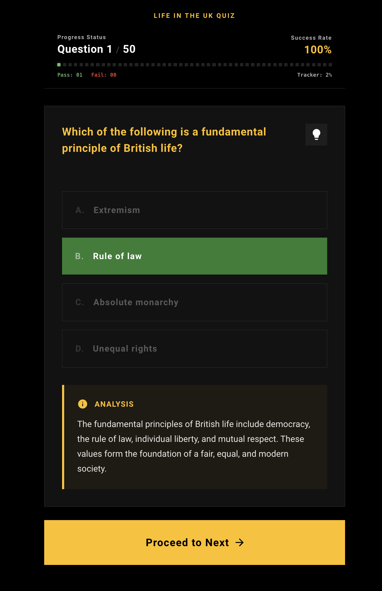

# Life in the UK Test Prep (2026 Edition)

An AI-powered preparation tool for the "Life in the United Kingdom" official test, specifically designed for 2026. This application leverages the Google Gemini API to dynamically generate high-quality, factually accurate practice questions.



## 🚀 Features

- **AI-Generated Questions**: Utilizes `gemini-3.1-pro-preview` (via Gemini 1.5/2.0 API) to generate unique questions per session, covering all official chapters.
- **2026 Ready**: Questions are context-aware for 2026, including updates for King Charles III and current UK laws.
- **Pedagogical Aids**: Each question includes a hint for critical thinking and a detailed explanation for historical or legal context.
- **Progress Tracking**: Real-time score tracking and visual progress indicators.
- **Responsive Design**: Built with Material UI (MUI) for a seamless experience across mobile and desktop.
- **Dynamic Difficulty**: A balanced mix of easy, medium, and hard questions, including scenario-based challenges.

## 🛠️ Tech Stack

- **Framework**: [Next.js 16](https://nextjs.org/) (App Router)
- **Language**: [TypeScript](https://www.typescriptlang.org/)
- **AI Engine**: [Google Gemini API](https://ai.google.dev/) (`@google/generative-ai`)
- **UI Components**: [Material UI (MUI)](https://mui.com/)
- **Styling**: Emotion (CSS-in-JS)

## 🏁 Getting Started

### Prerequisites

- [Node.js](https://nodejs.org/) (v20 or later)
- [pnpm](https://pnpm.io/) (preferred) or yarn/npm
- A [Google Gemini API Key](https://aistudio.google.com/)

### Installation & Local Development

1.  **Clone the repository**:

    ```bash
    git clone <repository-url>
    cd lifeintheuk
    ```

2.  **Install dependencies**:

    ```bash
    pnpm install
    ```

3.  **Set up environment variables**:
    Create a `.env` file in the root directory and add your Gemini API key:

    ```env
    GEMINI_API_KEY=your_api_key_here
    ```

4.  **Run the development server**:

    ```bash
    pnpm dev
    ```

5.  **Open the app**:
    Navigate to [http://localhost:3000](http://localhost:3000) to start your practice session.

## 🐳 Running with Docker

You can also run the application using Docker:

1.  **Build the image**:

    ```bash
    docker build -t lifeintheuk .
    ```

2.  **Run the container**:
    ```bash
    docker run -p 3000:3000 -e GEMINI_API_KEY=your_api_key_here lifeintheuk
    ```

## 🚀 Deployment

### Deploy to Vercel

The easiest way to deploy this app is to use the [Vercel Platform](https://vercel.com/new?utm_medium=default-template&filter=next.js&utm_source=create-next-app&utm_campaign=create-next-app-readme).

[](https://vercel.com/new/clone?repository-url=https%3A%2F%2Fgithub.com%2Fvercel%2Fnext.js%2Ftree%2Fcanary%2Fexamples%2Fhello-world&env=GEMINI_API_KEY&envDescription=Google%20Gemini%20API%20Key&envLink=https%3A%2F%2Faistudio.google.com%2Fapp%2Fapikey)

### Other Hosting Options

- **Heroku**: Deploy using the [Heroku Container Registry](https://devcenter.heroku.com/articles/container-registry-and-runtime) with the provided `Dockerfile`.
- **Railway**: Connect your repository to [Railway](https://railway.app/) for automatic deployment and environment variable management.
- **Render**: Use [Render](https://render.com/) to deploy as a Web Service, either via Git or the Docker image.
- **Docker-based hosting**: Deploy the Docker image to services like **Google Cloud Run**, **AWS ECS**, or **DigitalOcean App Platform**.

## 📖 How it Works

The application fetches questions from a serverless API route (`/api/questions`) which streams responses directly from the Gemini AI model. The prompt is engineered to ensure coverage of all five official "Life in the UK" chapters, providing a balanced and realistic test experience.

## 🤝 Contributing

Contributions are welcome! Please feel free to submit a Pull Request.
